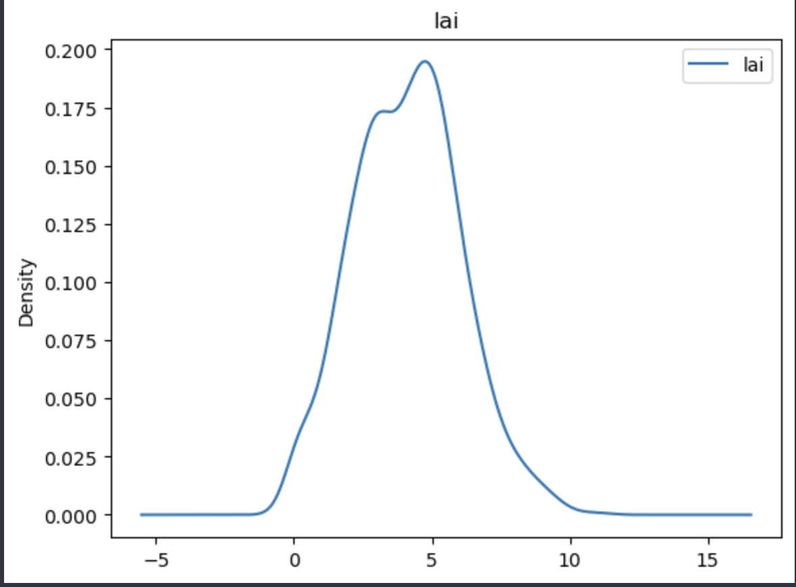
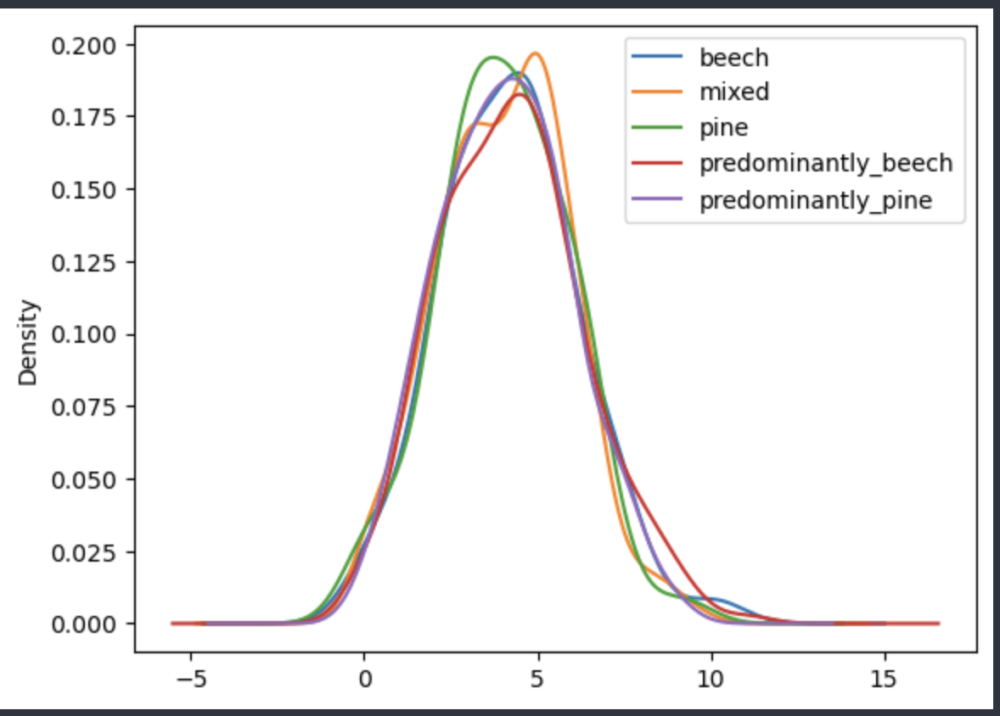

# Report

## The data content

The csv file contains 2114 columns, with 2101 different wavelength levels, 10 different sentinels, wetness, treeSpeieces and the lai. The goal of using this csv file is to predict lai value of unknow data samples providing the values of other 2113 features.

There are in total 1000 samples and 66 NaN values distributing as follows:

```
nan_result: {'Sentinel_2A_704.1': 10, 'Sentinel_2A_740.5': 10, 'Sentinel_2A_782.8': 10, 'w469': 10, 'w470': 5, 'w471': 5, 'w473': 8, 'w474': 8}
```

The percentage is relatively low and could be ignored.

## The data analytics

The distribution of lai value is close to normal distribution:

The distribution of different trees are not balanced:

```
treeSpecies           1000
beech                   58
mixed                  392
pine                    63
predominantly_beech    229
predominantly_pine     258
```

However, the distribution among different sentinels are balanced and close to normal distribution. So the tree spieces will largely not be a good feature to predict the lai value.

